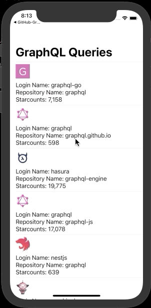

A SwiftUI listview utilizing Github's GraphQL API.
To run the app with a list of queries, you will need to replace `placeholder-token` with your github's private token, otherwise it will be an empty list.

